# Status update

## Robust counterfactual explanations

 

## February 2026

### Marcin Kostrzewa

---

# Motivation

Classifiers change over time:
- Retrained on new data
- Hyperparameters tuned
- Architecture modifications

 

A counterfactual $x'$ valid for model $M$ may become **invalid** after $M$ is updated.

 

**Goal:** Generate counterfactuals that remain valid across plausible model changes.

<SlideNumber/>

---

# Robust CFE &mdash; Problem Setup

 

**Setting:** Dataset $X = \{x_i\}_{i=1}^{N}$ with classes $\mathcal{C} = \{1,\ldots,C\}$

 

**Space of admissible models** $\mathcal{M}$ (following Stępka et al., 2025):

> The probabilistic distribution of all models resulting from complete retraining of $M$ using arbitrary settings from a predefined set of model changes.

 

We sample $K$ models $M_1,\ldots,M_K$ from $\mathcal{M}$.

<SlideNumber/>

---

# Generating Model Variants

How to sample from $\mathcal{M}$?

 

**Bootstrap resampling:**
- Create bootstrap samples of the training data
- Retrain the model on each bootstrap dataset

**Weight perturbation:**
- Add noise to model weights (linear models, neural networks)

**Architecture changes (neural networks):**
- Add or remove layers
- Add or remove neurons within layers

<SlideNumber/>

---

# Consensus Vector

For each point $x$, define $\mathbf{p}(x) = (p_1,\ldots,p_C) \in [0,1]^C$, where:

$$p_i = \mathbb{E}_{M \sim \mathcal{M}}[M(x)]_i$$

is the average probability assigned to class $i$ across models.

 

In practice, approximated with $K$ sampled models:

$$p_i \approx \frac{1}{K}\sum_{k=1}^{K} [M_k(x)]_i$$

<SlideNumber/>

---

# Conditional Normalizing Flow

Learn $p_\theta(x \mid \mathbf{c})$ where $\mathbf{c} \in [0,1]^C$ is the consensus vector.

**Training:** Pairs $\{(x_i, \mathbf{p}(x_i))\}_{i=1}^N$.

 

**Counterfactual generation** &mdash; for target class $c'$:

$$x' = \arg\min_x \; d(x_0, x) + \lambda \cdot \max\left(0, \; \tau - \log p_\theta(x' \mid \mathbf{e}_{c'})\right)$$

where $\mathbf{e}_{c'} \in \{0,1\}^C$ is the one-hot vector for $c'$ and $\tau$ is the **median** of $\log p_\theta(x)$ over the training data.

<SlideNumber/>

---

# Problem?

Conditioning on $\mathbf{e}_{c'}$ means we require **all classifiers to agree** on class $c'$ with probability 1.

 

The flow pushes the counterfactual toward regions where $\mathbf{p}(x) \approx \mathbf{e}_{c'}$ &mdash; perfect consensus.

 

These regions may be **far from the original instance** $x_0$, leading to a **high proximity cost** $d(x_0, x')$.

 

**Can we relax the consensus requirement?**

<SlideNumber/>

---

# Relaxed Consensus Conditioning

Same flow, same training, but different inference.

Instead of conditioning on $\mathbf{e}_{c'}$, sample consensus vectors from:

$$\mathcal{C}_{c'} = \{\mathbf{p} : p_{c'} \geq \gamma\}, \quad \text{e.g. } \gamma = 0.9$$

 

**Theoretical objective:**

$$x' = \arg\min_x \; d(x_0, x) + \lambda \cdot \max\left(0, \; \tau - \mathbb{E}_{\mathbf{c} \sim \mathcal{C}_{c'}} \left[\log p_\theta(x' \mid \mathbf{c})\right]\right)$$

**Approximation** with $L$ sampled vectors $\mathbf{c}_1, \ldots, \mathbf{c}_L \in \mathcal{C}_{c'}$:

$$x' = \arg\min_x \; d(x_0, x) + \lambda \cdot \max\left(0, \; \tau - \frac{1}{L}\sum_{l=1}^{L} \log p_\theta(x' \mid \mathbf{c}_l)\right)$$

<SlideNumber/>

---

# Key Properties

**Classifier-agnostic:**
- Does **not** require gradients from the classifier (as PPCEF for instance)
- Classifiers are used only to label the dataset

 

**Plausibility:**
- The flow directly models $p(x \mid c')$ &ndash; the distribution of class $c'$
- Counterfactuals are pushed toward high-density regions of the target class

 

**Robustness:**
- By training on labels from multiple model variants, the flow captures the **consensus** decision surface
- Counterfactuals are valid across the space of admissible models $\mathcal{M}$

<SlideNumber/>

---

# Other news

  
  
  

*Towards plausibility in time series counterfactual explanations*

got accepted at **ACIIDS 2026**

<SlideNumber/>

---

  <h1 style="font-size: 5em;">Thanks!</h1>

<SlideNumber/>
